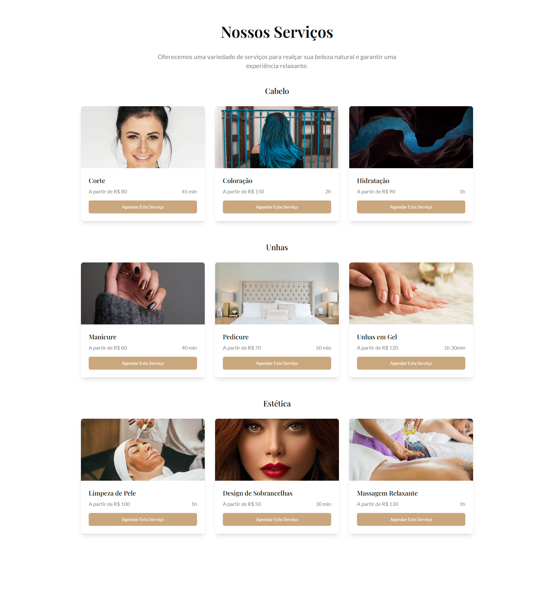
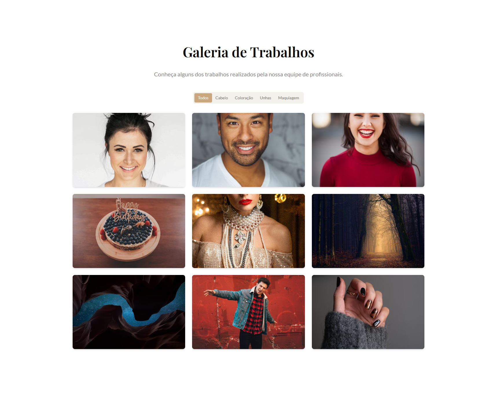

# DevPorto Beauty - Salão de Beleza

[](LICENSE)
[](https://reactjs.org/)
[](https://tailwindcss.com/)
[](https://www.typescriptlang.org/)
[](https://vitejs.dev/)

Um site moderno e responsivo para um salão de beleza premium, com agendamento online, apresentação de serviços, perfis de equipe e muito mais.


## 🌟 Funcionalidades

- **Design Moderno e Responsivo** - Ótima aparência em todos os dispositivos
- **Sistema de Agendamento Online** - Clientes podem agendar horários em apenas 3 cliques
- **Apresentação de Serviços** - Exibição categorizada de todos os serviços do salão com preços
- **Perfis da Equipe** - Apresente sua talentosa equipe com certificações
- **Galeria** - Galeria filtrável de amostras de trabalhos
- **Depoimentos de Clientes** - Construa confiança com avaliações reais de clientes
- **Informações de Contato** - Fácil de encontrar com mapa integrado

## 📋 Índice

- [Demonstração](#demonstração)
- [Instalação](#instalação)
- [Uso](#uso)
- [Estrutura do Projeto](#estrutura-do-projeto)
- [Tecnologias](#tecnologias)
- [Contribuindo](#contribuindo)
- [Licença](#licença)
- [Contato](#contato)

## 🚀 Demonstração

[Demonstração ao Vivo](https://devporto-beauty.vercel.app/)

## 💻 Instalação

Para executar este projeto localmente, siga estes passos:

```bash
# Clone o repositório
git clone <url-do-seu-repositorio>

# Navegue para o diretório do projeto
cd devporto-beauty

# Instale as dependências
npm install

# Inicie o servidor de desenvolvimento
npm run dev
```

## 🔍 Uso

Após iniciar o servidor de desenvolvimento, abra seu navegador e navegue para `http://localhost:8080` para visualizar o site.

### Seções Principais:

1. **Início/Hero** - Ponto de entrada cativante com uma chamada para ação clara
2. **Agendamento** - Interface de agendamento simples e intuitiva
3. **Serviços** - Serviços categorizados com preços e duração
4. **Equipe** - Perfis dos funcionários com especialidades e certificações
5. **Galeria** - Portfólio de trabalhos filtrável
6. **Depoimentos** - Avaliações de clientes com classificações
7. **Contato** - Formulário de contato, mapa de localização e horário de funcionamento

## 📁 Estrutura do Projeto

```
src/
├── components/       # Componentes de UI reutilizáveis
│   ├── ui/           # Componentes shadcn/ui
│   ├── Hero.tsx      # Seção hero da landing page
│   ├── Services.tsx  # Seção de serviços
│   └── ...           # Outros arquivos de componentes
├── pages/            # Componentes de página
│   └── Index.tsx     # Layout principal da página
├── lib/              # Funções utilitárias
├── hooks/            # Hooks React personalizados
├── App.tsx           # Componente raiz
└── main.tsx          # Ponto de entrada
```

## 🛠️ Tecnologias

| Categoria         | Tecnologias                                        |
|-------------------|-----------------------------------------------------|
| **Frontend**      | React, TypeScript, Tailwind CSS                     |
| **Componentes UI**| shadcn/ui                                           |
| **Ferramenta de Build** | Vite                                                |
| **Ícones**        | Lucide React                                        |
| **Animações**     | Animações Tailwind CSS                              |
| **Tipografia**    | Playfair Display, Lato (Google Fonts)               |

## 🎨 Elementos de Design

### Paleta de Cores

- Primária (Dourado): `#C9A77C`
- Creme Claro: `#F4F1EC`
- Cinza Escuro: `#232323`
- Taupe Suave: `#8A8582`

### Tipografia

- Títulos: Playfair Display (serifada)
- Corpo: Lato (sem serifa)

## 🤝 Contribuindo

Contribuições são bem-vindas! Sinta-se à vontade para enviar um Pull Request.

1. Faça um fork do repositório
2. Crie sua branch de feature (`git checkout -b feature/feature-incrivel`)
3. Faça commit de suas alterações (`git commit -m 'Adiciona alguma feature incrível'`)
4. Faça push para a branch (`git push origin feature/feature-incrivel`)
5. Abra um Pull Request

## 📄 Licença

Este projeto está licenciado sob a Licença MIT - veja o arquivo LICENSE para detalhes.

## 📬 Contato

Link do Projeto: [https://github.com/devrpgs/devporto-beauty](https://github.com/devrpgs/devporto-beauty)

## 📸 Capturas de Tela

### Página Inicial


### Seção de Serviços


### Perfis da Equipe


### Galeria


---

Feito com ❤️ por DevPorto
